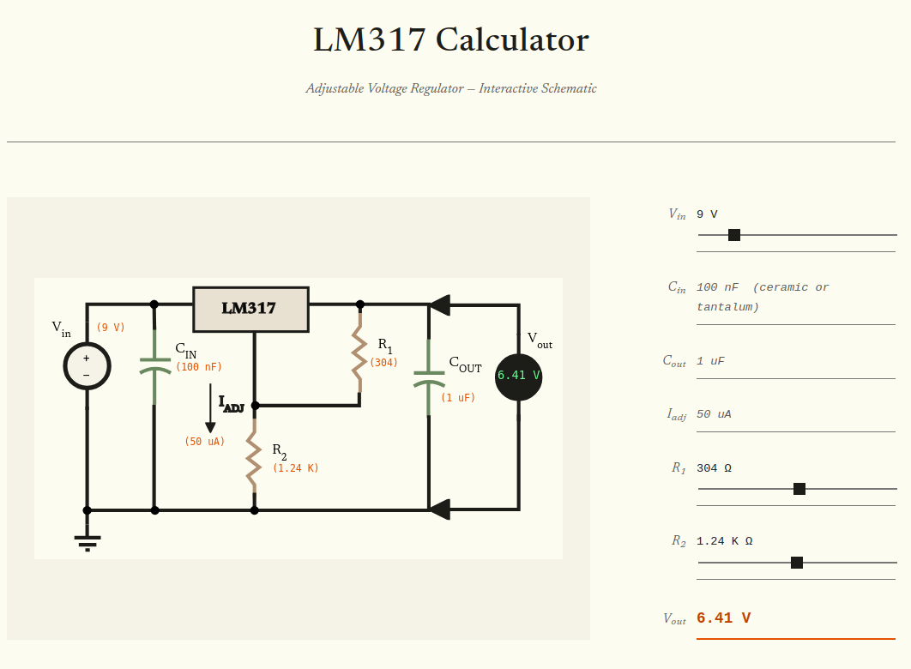

# LM317 Calculator

Interactive calculator for the LM317 adjustable voltage regulator. Adjust input voltage, R1 and R2 resistor values with sliders and see the output voltage update in real time alongside the circuit schematic.



## Development

```sh
npm install
npm run dev
```

## Tests

```sh
npm test
```

## Build

```sh
npm run build
```
